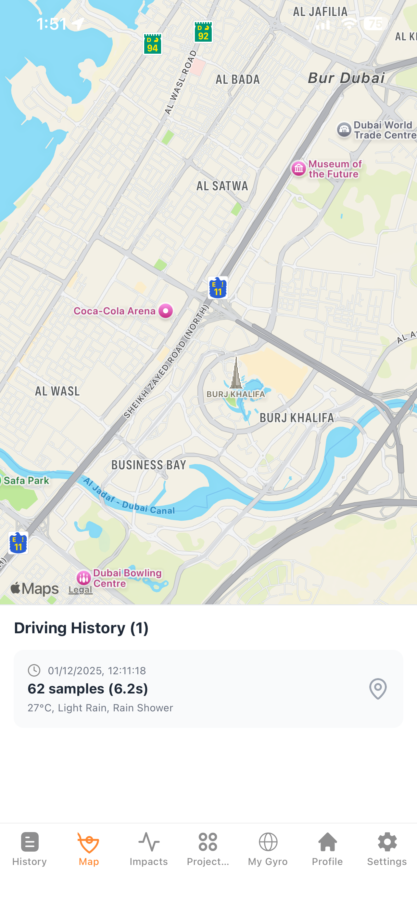

# 📱 MyGyroApp - Road Anomaly Detection System

A digital systems project for detecting and analyzing road anomalies using ESP32 and gyroscope sensors to quantify the impact of road-induced motions on driver health parameters.

## 📖 Project Description

Road conditions significantly influence driver health through **Whole-Body Vibration (WBV)** and **Driver Stress (DS)**. This mobile application works in conjunction with ESP32 hardware to collect real-world, low-cost road data and link measurable road-induced motions with physiological outcomes.

### The Problem
- WBV from road surfaces affects driver vigilance and increases stress
- 55.30% of professional drivers experience Low Back Pain (LBP)
- Poor road conditions impair attention and decision-making ability
- Long-term exposure leads to musculoskeletal disorders and increased accident risk

### My Solution
Using ESP32 microcontrollers with integrated gyroscope and accelerometer sensors, we collect comprehensive road quality data including:
- Multi-sensor motion data (gyroscope, accelerometer)
- GPS coordinates per sample
- Weather conditions per session
- Exportable CSV data for analysis

---

## 🚀 Installation & Run Instructions

### Prerequisites
- **Node.js** (LTS version) - [Download here](https://nodejs.org/)
- **Expo Go** app on your smartphone ([iOS](https://apps.apple.com/app/expo-go/id982107779) | [Android](https://play.google.com/store/apps/details?id=host.exp.exponent))
- Computer and smartphone on the **same WiFi network**

### Step 1: Clone the Repository
```bash
git clone https://github.com/yourusername/MyGyroApp.git
cd MyGyroApp
```

### Step 2: Install Dependencies
```bash
npm install
```

### Step 3: Configure Environment Variables
```bash
# Copy the example environment file
cp .env.example .env

# Edit .env with your API keys and configuration
# Required variables:
# - API_URL: Your backend API endpoint
# - SECRET_KEY: Application secret key
```

### Step 4: Start the Development Server
```bash
npm start
```

### Step 5: Open on Your Device
- **iOS**: Open Camera app and scan the QR code
- **Android**: Open Expo Go app and scan the QR code

The app will load automatically on your device!

---

## ✨ Features

### 📊 Multi-Sensor Recording
Record comprehensive motion data from your device's sensors including:
- **Gyroscope**: Angular velocity measurements (X, Y, Z axes)
- **Accelerometer**: Linear acceleration data
- **Magnetometer**: Orientation and heading information
- **Configurable sampling rate** for different use cases

### 📍 GPS Tracking
- Real-time location tracking during recording sessions
- GPS coordinates captured per sample
- Location accuracy indicators
- Distance and speed calculations
- Route visualization on maps
- **Driving History Map**: Interactive map showing all recorded routes with start/end points
- **Interactive Markers**: Tap on route to see detailed sensor data at that location

### 💥 Impact Detection System
- **Real-time Monitoring**: Dedicated dashboard for G-force monitoring
- **Shock Detection**: Automatically flags road anomalies (>1.5g)
- **Impact Mapping**: Red markers on the map pinpointing where impacts occurred
- **Severity Classification**: Distinguishes between minor bumps and severe impacts


### 🌤️ Weather Integration
- Automatic weather data collection per session
- Temperature, humidity, and atmospheric pressure
- Weather conditions (clear, rainy, cloudy, etc.)
- Correlation between weather and road conditions

### 📁 Data Export & Analysis
- **CSV Export**: Export all recorded data in CSV format
- **Session Management**: View, organize, and delete recording sessions
- **Data Visualization**: Charts and graphs for sensor data
- **Sharing**: Share exported data via email or cloud storage

### 🎨 User Interface
- **Onboarding**: Comprehensive project overview and feature introduction
- **Project Overview**: Detailed explanation of research goals and methodology
- **Recording Interface**: Real-time sensor data visualization
- **History**: Browse and manage past recording sessions
- **Settings**: Customize app preferences and language

### 🌍 Internationalization
- Multi-language support (English, Arabic)
- RTL (Right-to-Left) layout support
- Easy language switching in settings

### 🎨 Theming
- Light and dark mode support
- Automatic theme detection based on system preferences
- Smooth theme transitions

---

## 📸 Screenshots

### Onboarding Screen

*Comprehensive introduction to MyGyroApp and its research objectives*

### Project Overview

*Detailed explanation of the road anomaly detection methodology*

### Recording Interface

*Real-time sensor data visualization during active recording*

### Session History

*Browse and manage past recording sessions*

### My Gyro Dashboard

*Main dashboard for sensor monitoring and recording controls*

### Settings

*App configuration, language selection, and theme preferences*

### Driving History Map

*Interactive map showing GPS routes and impact markers*

### Impact Monitor

*Real-time G-force meter and impact history*

---

## 🛠️ Technologies Used

### Frontend Framework
- **React Native** (0.79.5) - Cross-platform mobile development
- **Expo** (~53.0.6) - Development platform and tooling
- **Expo Router** (~5.1.7) - File-based navigation system
- **TypeScript** (~5.8.3) - Type-safe JavaScript

### UI & Styling
- **NativeWind** (4.1.21) - Tailwind CSS for React Native
- **Tailwind CSS** (^3.4.0) - Utility-first CSS framework
- **Lucide React Native** (^0.554.0) - Icon library
- **Moti** (^0.30.0) - Animations library

### State Management
- **MobX** (^6.15.0) - Reactive state management
- **MobX React Lite** (^4.1.1) - React bindings for MobX
- **MobX Persist Store** (^1.1.8) - State persistence

### Forms & Validation
- **React Hook Form** (^7.63.0) - Form handling
- **Zod** (^4.1.11) - Schema validation
- **@hookform/resolvers** (^5.2.2) - Validation resolvers

### Data Visualization
- **React Native Gifted Charts** (^1.4.68) - Charts and graphs
- **React Native SVG** (15.11.2) - SVG rendering

### Sensors & Location
- **Expo Sensors** (~14.1.4) - Gyroscope, accelerometer, magnetometer
- **Expo Location** (~18.1.6) - GPS and location services
- **Expo Device** (~7.1.4) - Device information

### Storage & File System
- **Expo File System** (~18.1.11) - File operations
- **Expo Sharing** (~13.1.5) - File sharing capabilities
- **AsyncStorage** (2.1.2) - Local data persistence

### Networking & APIs
- **Axios** (^1.7.5) - HTTP client
- **@tanstack/react-query** (^5.90.2) - Data fetching and caching

### Internationalization
- **i18next** (^25.5.3) - Internationalization framework
- **react-i18next** (^16.0.0) - React bindings for i18next

### Development Tools
- **ESLint** (^9.25.1) - Code linting
- **Prettier** (^3.2.5) - Code formatting
- **Babel** (^7.20.0) - JavaScript compiler

---

## 🐛 Known Issues

### Current Limitations
1. **Offline Mode**: Weather data requires internet connection
2. **Battery Consumption**: Continuous sensor recording drains battery faster
3. **Storage**: Large recording sessions may consume significant device storage
4. **Background Recording**: iOS limitations on background sensor access

### Platform-Specific Issues
- **iOS**: Background location tracking requires additional permissions
- **Android**: Some devices may have sensor calibration issues

---

## 🚧 Future Improvements

### Planned Features
1. **Real-time Analysis**
   - On-device machine learning for road quality classification
   - Instant anomaly detection alerts
   - Severity scoring for detected anomalies

2. **Cloud Integration**
   - Automatic cloud backup of recording sessions
   - Collaborative data sharing with research teams
   - Centralized database for road quality mapping

3. **Enhanced Visualization**
   - 3D road surface reconstruction
   - Heat maps for road quality
   - Interactive route playback with sensor overlay

4. **Hardware Integration**
   - Direct ESP32 Bluetooth connectivity
   - Real-time data streaming from external sensors
   - Multi-device synchronization

5. **Advanced Analytics**
   - Driver health impact predictions
   - Route optimization based on road quality
   - Comparative analysis across different road types

6. **Social Features**
   - Community-driven road quality reports
   - Crowdsourced road anomaly database
   - Driver health statistics and insights

### Research Extensions
- Integration with vehicle OBD-II data
- Correlation with traffic accident statistics
- Long-term driver health monitoring
- Policy recommendation generation

---

## 📚 Project Structure

```
MyGyroApp/
├── src/
│   ├── app/                      # Application screens (file-based routing)
│   │   ├── (app)/               # Protected app screens
│   │   │   ├── index.tsx        # History/Home screen
│   │   │   ├── style.tsx        # Project Overview screen
│   │   │   ├── mygyro.tsx       # Sensor dashboard
│   │   │   ├── map.tsx          # Driving history map
│   │   │   ├── impacts.tsx      # Impact detection monitor
│   │   │   ├── profile.tsx      # User profile
│   │   │   ├── settings.tsx     # App settings
│   │   │   └── _layout.tsx      # Tab navigation layout
│   │   ├── (auth)/              # Authentication screens
│   │   │   ├── onboarding.tsx   # Onboarding flow
│   │   │   └── login.tsx        # Login screen
│   │   ├── providers/           # Context providers
│   │   └── _layout.tsx          # Root layout
│   ├── components/              # Reusable UI components
│   │   ├── ui/                  # Base UI components
│   │   ├── settings/            # Settings components
│   │   └── weather-widget.tsx   # Weather display
│   ├── stores/                  # MobX state stores
│   │   ├── auth-store.ts        # Authentication state
│   │   ├── ui-language-store.ts # Language preferences
│   │   └── ui-theme-store.ts    # Theme preferences
│   ├── lib/                     # Utilities and helpers
│   │   ├── i18n/               # Internationalization
│   │   └── logger.ts           # Logging utilities
│   └── translations/            # Language files
├── assets/                      # Images, fonts, etc.
├── .env.example                 # Environment variables template
├── app.config.js               # Expo configuration
├── eas.json                    # EAS Build configuration
└── package.json                # Dependencies
```
---

## 🎓 Research Context

This application is part of a comprehensive study on:
- **Whole-Body Vibration (WBV)** effects on professional drivers
- **Driver Stress (DS)** correlation with road geometry
- **Low Back Pain (LBP)** prevalence in occupational driving
- **Road infrastructure** impact on public health

### Research Objectives
1. Quantify measurable road-induced motions
2. Link road quality data to physiological outcomes
3. Provide evidence for road infrastructure improvements
4. Support occupational health policies for professional drivers

---

---

## 🔐 Environment Variables & Secrets

**Important**: Never commit sensitive values to the repository.

### Local Development
1. Copy `.env.example` to `.env`
2. Fill in your API keys and configuration
3. The `.env` file is gitignored by default

### Production/CI Builds
Use your CI provider's secret management:
- **GitHub Actions**: Repository Settings → Secrets
- **EAS Build**: `eas secret:create`

Example GitHub Actions workflow:
```yaml
env:
  API_URL: ${{ secrets.API_URL }}
  SECRET_KEY: ${{ secrets.SECRET_KEY }}
```

---

## 🐛 Troubleshooting

### App Won't Load
1. Ensure both devices are on the **same WiFi network**
2. Restart the Metro bundler: `npm start -- --reset-cache`
3. Clear Expo cache: `expo start --clear`
4. Restart Expo Go app on your device

### Sensor Data Not Recording
1. Check device permissions (Location, Motion & Fitness)
2. Ensure sensors are available on your device
3. Try restarting the app
4. Check device sensor calibration

### GPS Not Working
1. Enable Location Services in device settings
2. Grant location permissions to Expo Go
3. Ensure you're outdoors or near a window for better signal
4. Check if location services are enabled for the app

### Export/Sharing Issues
1. Grant storage permissions
2. Ensure sufficient device storage
3. Check file system permissions
4. Try a different export format

---

**Built with ❤️ for safer roads and healthier drivers**
